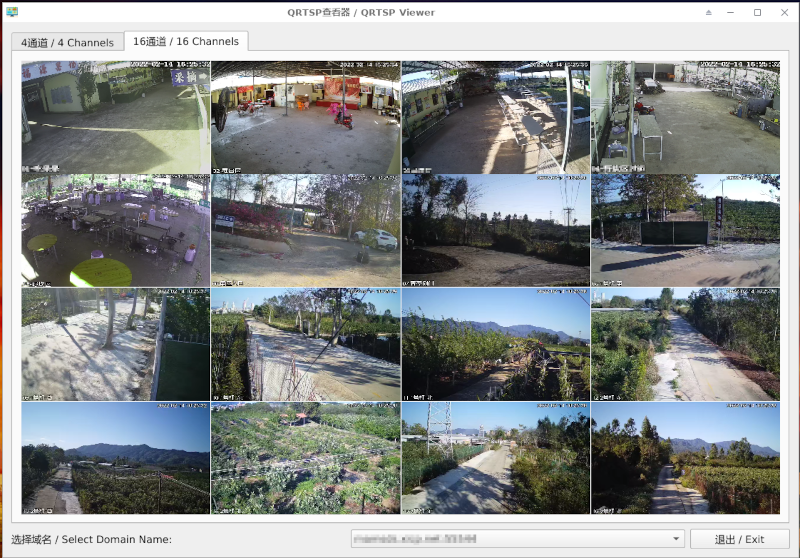

000000000000# Q-RTSP-Viewer

A Qt-based cross-platform RTSP stream viewer.

## Screenshot



## Deployment

### Windows

`./Qt/6.2.3/mingw_64/bin/windeployqt.exe --release ./q-rtsp-viewer/releases/Windows_Qt_6_2_3_MinGW_64/`

## OpenCV Installation and Reference

* It turns out that installaton of OpenCV is a big headache.
* Seems bugs are not uncommon in OpenCV--at least try avoiding the latest-dev version.
* OpenCV 3.4.16 is used.

### References

#### Windows

The exact process is not exactly the same as any of the links...

* [Installation in Windows](https://docs.opencv.org/4.5.5/d3/d52/tutorial_windows_install.html)
* [How to setup Qt and openCV on Windows](https://wiki.qt.io/How_to_setup_Qt_and_openCV_on_Windows)
* [Windows10下QT6.0(C++)+OpenCV4环境配置及安装](https://blog.csdn.net/u011826081/article/details/113081099)


#### Linux

* [Installation in Linux](https://docs.opencv.org/4.5.5/d7/d9f/tutorial_linux_install.html)

##### Find out the right way to add references

* To check available libraries installed, run `pkg-config --libs opencv`
* Sample results

```
-L/usr/local/lib -lopencv_dnn -lopencv_highgui -lopencv_ml -lopencv_objdetect -lopencv_shape -lopencv_stitching -lopencv_superres -lopencv_videostab -lopencv_calib3d -lopencv_videoio -lopencv_imgcodecs -lopencv_features2d -lopencv_video -lopencv_photo -lopencv_imgproc -lopencv_flann -lopencv_core
```
